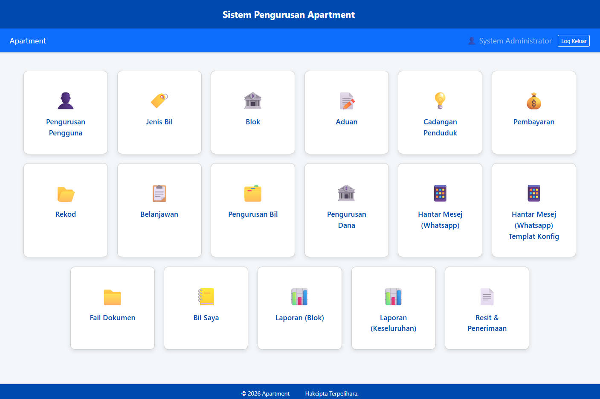
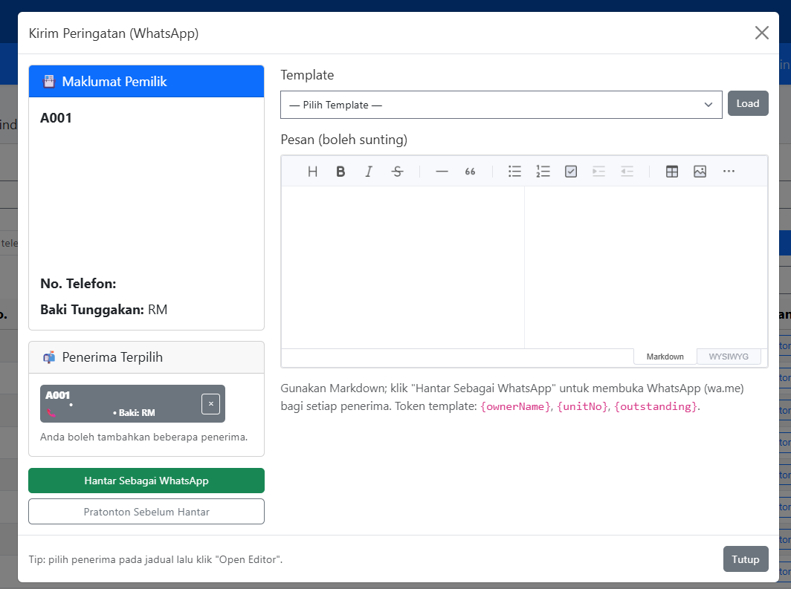

# Tenant Management System (TMS)

## Overview
Tenant Management System (TMS) is a web-based platform designed to manage tenants, payments, and maintenance operations for residential properties.

## Purpose
To replace fragmented manual processes with a centralized system that improves visibility, financial tracking, and communication between management and tenants.

## Key Features
- Tenant registration and management
- Unit-based billing and payment tracking
- Maintenance and complaint request system
- Dashboard with statistics and summaries
- Automated notifications (SMS & WhatsApp)
- Announcements and notices
- Report generation (PDF)

## Tech Stack
- Laravel (PHP Framework)
- MySQL
- JavaScript (jQuery, AJAX)
- Bootstrap

## My Role
- Sole developer (client-commissioned project)
- Gathered requirements directly from client
- Designed system workflows and database structure
- Developed full backend and frontend
- Integrated external APIs (SMS & WhatsApp)
- Delivered complete working system

## Impact
- Improved tracking of maintenance fees and payments
- Reduced manual administrative workload
- Automated tenant communication
- Increased efficiency in property management operations

---

## Screenshots

### Dashboard
Overview of system statistics such as occupancy, payments, and maintenance requests.

---

### Tenant Management
Manage tenant profiles, unit assignments, and historical records.

---

### Billing & Payments
Track monthly charges, payment history, and outstanding balances.

---

### Maintenance Requests
Submit, assign, and track maintenance issues.

---

### Notifications Module
Send SMS and WhatsApp messages to tenants directly from the system.

---

### Reports & Analytics
Generate PDF reports for management review.

---

## System Flow
Tenant submits request → System records data → Management reviews → Action assigned → Status updates → Completion & reporting

## Challenges & Solutions

**Challenge:** Manual tracking of payments and tenants  
**Solution:** Built structured database with unit-based billing system

**Challenge:** Slow communication with tenants  
**Solution:** Integrated SMS and WhatsApp notification system

**Challenge:** Managing multiple roles and permissions  
**Solution:** Implemented role-based access control (RBAC)

## Key Design Decisions

- Used Laravel MVC for maintainability and scalability
- Designed role-based system for multiple user types
- Integrated external APIs for automated communication
- Structured database for unit-based financial tracking

## Before vs After

Before:
- Manual records
- No centralized tracking
- Slow communication with tenants

After:
- Fully digital system
- Real-time tracking
- Automated messaging and reporting

## Testing Approach

- Manual testing across different user roles
- Validation of billing and payment flows
- Testing of notification delivery (SMS & WhatsApp)
- Edge case testing for maintenance workflows

## Project Structure (Conceptual)

- Frontend (UI & user interaction)
- Backend (Laravel business logic)
- Database (tenant, billing, maintenance data)
- API layer (SMS & WhatsApp integration)

**Features:** Tenant Management · Billing System · Maintenance Workflow · Notifications · Reporting

## Future Improvements

- Migrate frontend to modern framework (Vue/React)
- Improve performance for larger datasets
- Add mobile-friendly enhancements
- Introduce real-time notifications

## 🔒 Confidentiality Notice
This project was developed for a client.  
All sensitive data and source code are intentionally omitted due to NDA.
